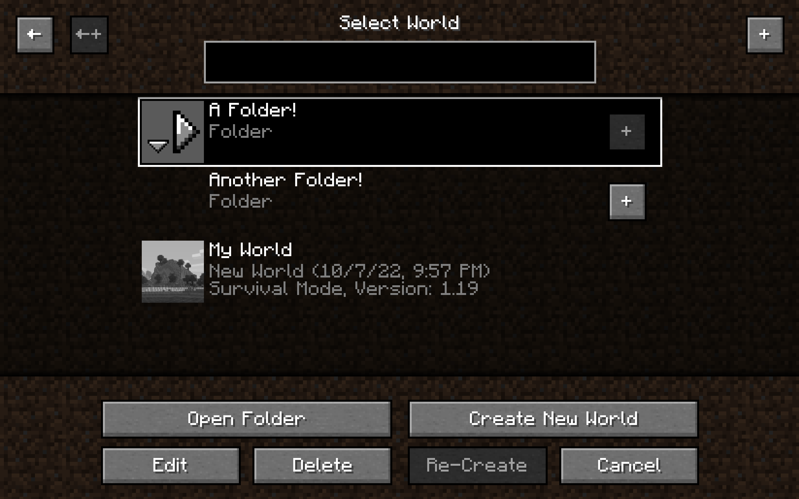
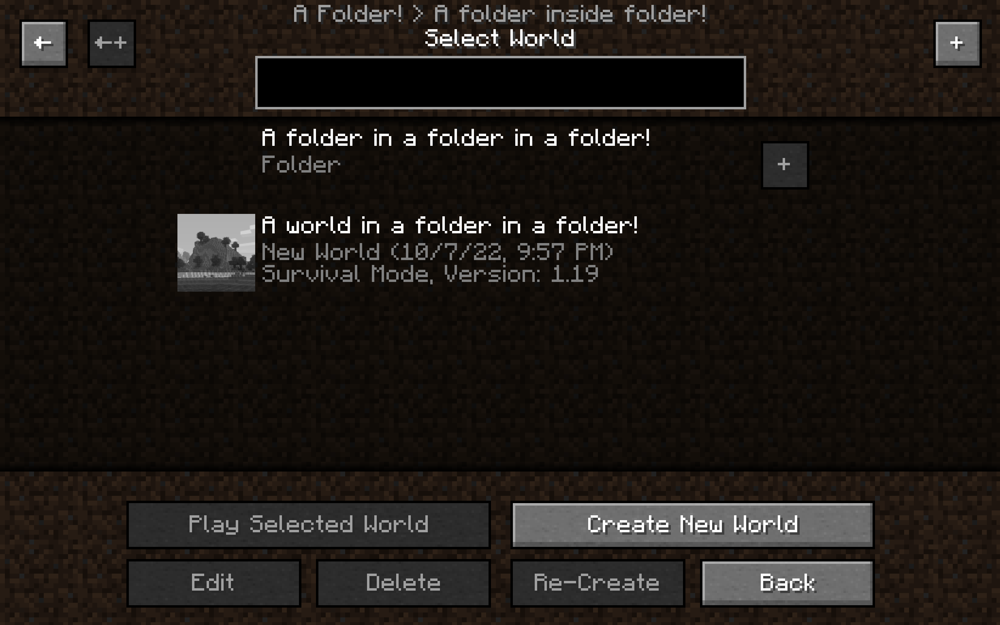
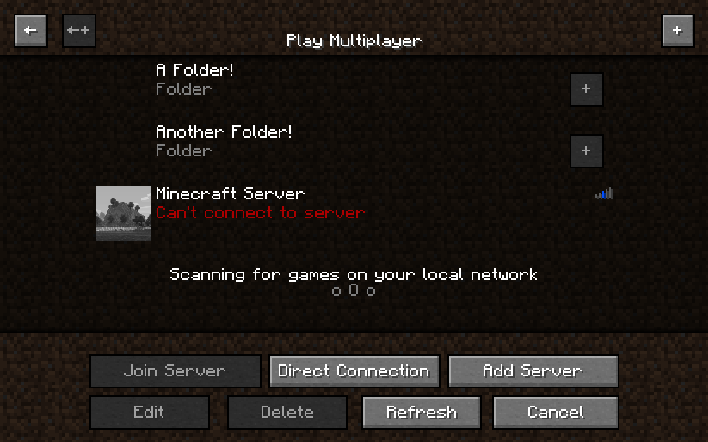

# Organizable Play Screens

Organize your worlds and servers with folders in the play screens.

* Add folders with custom names to your singleplayer and multiplayer screens.
* Move entries in and out of folders.
* Organize your worlds and servers as you wish.
* The path to the current folder is shown at the top, except for the root folder.
* Searching for worlds still works. The path of the selected world will be shown. You will be taken to the selected
  world's folder after you finish searching.

This mod does not alter vanilla behavior. You can remove this mod at any time and all your worlds and servers will be
displayed normally. You can even reinstall this mod and your folders will still be there (unless you delete
the `organizable_worlds.dat` and `organizable_servers.dat` files in the run directory).

## Pictures

Click to expand

## Requirements

Minecraft Version 1.19+  
[Fabric Loader](https://fabricmc.net/)  
[Fabric Api](https://minecraft.curseforge.com/projects/fabric/files)